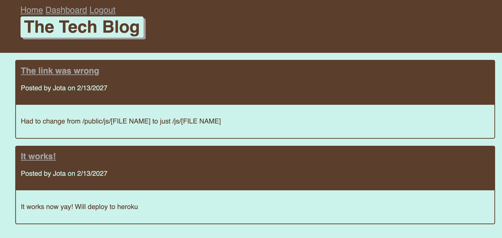

# Tech-Blog-Challenge

## Description

This is a WordPress style blog that allows users to sign-up and login to post about whatever Tech they are working on.

## Table of Contents 

* [Usage](#usage)
* [License](#license)
* [Documentation](#documentation)

## Usage

You will need to clone the repo from my github page: [My Github](https://github.com/Iviviana/Tech-Blog-Challenge). Once you have it set up, make sure to have the server running, and on the command line write `npm start` to have it run.

The homepage will display any posts that have been written by users. However to add any posts or comments of your own, you will need to sign up or login if you already have an account.

## License

Licensed under MIT

## Documentation

* [My Github](https://github.com/Iviviana/Tech-Blog-Challenge)
* [Heroku]()